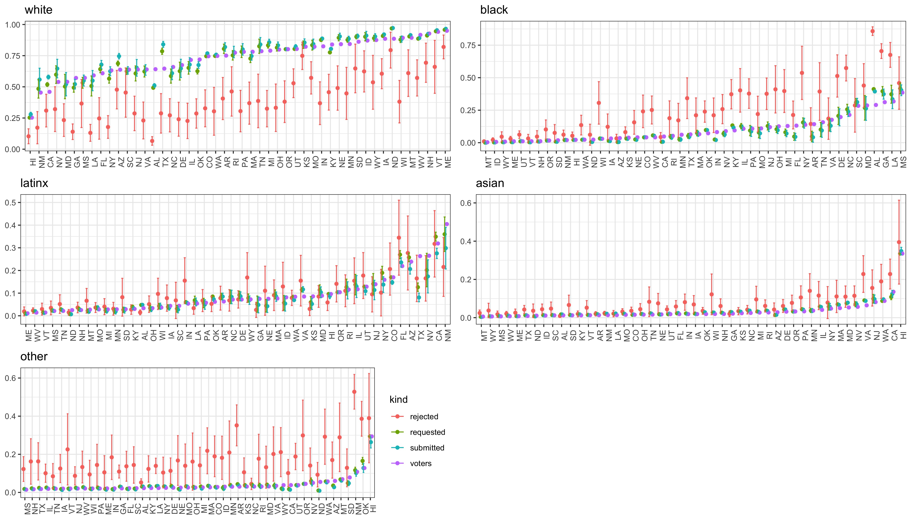
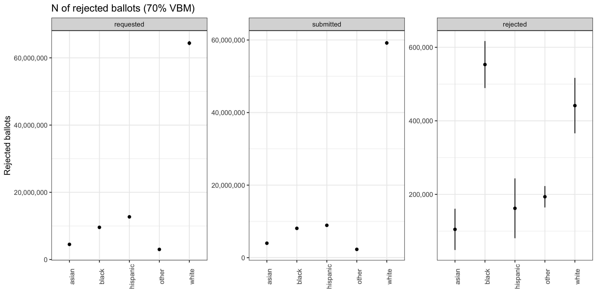

# Estimating Rejection Rates by Ethnic Group

Although absentee voting/vote-by-mail (VBM) may be a safe alternative to voting in person, it might disenfranchise underserved communities. A missing witness signature or a non-official envelope might disqualify a ballot. And rejection rates can vary widely across socio-demographic groups. A [study](https://electionscience.clas.ufl.edu/files/2020/04/Baringer_Herron_Smith_VBM_FL.pdf) of voting lists in Florida found that the absentee ballot rejection rates for minorities are twice as large as for white Americans (approximately 2% vs 1%). Other studies from elections in [LA](https://www.sciencedirect.com/science/article/pii/S0261379408000796) and [Georgia](https://electionscience.clas.ufl.edu/files/2020/05/GA_Venmo.pdf)  found higher rejection rates from first-time and non-white voters.

## Updates 

* *Monday, September 28th, 2020:* I took the number of absentee ballots requested so far from the NYT website and am using them instead of assuming a 70% absentee request rate across all states.
* *Sunday, September 27th, 2020*: I went through the EAVS data and where possible fixed the data for ballots transmitted, submitted, counted, and rejected. There are still counties that are getting dropped due to missing or clearly false data but their number is in the high single/very low double digits.

## Approach

To estimate a rejection rate of an ethnic group we would look at the share of the submitted absentee ballots of that group that had been rejected. This data is not available partially due to confidentiality concerns. The same problem exists for example if we want to estimate the share of a particular ethnic group that voted for a specific candidate (without survey data).

Instead, we can use ecological regression, a method that under some assumptions [^1] can estimate individual level behavior from aggregate data. This requires predicting for example the share of requested ballots at the county level with the local ethnic composition. As a mock-up, consider a hypothetical county that has a request rate of 75% and is 100% Latinx. The prediction then looks like 
$$
0.75 = \beta_{1}x_{1} + \beta_2x_2
$$
If $x_2 = 1$ (share Latinx), $x_1 = 0$ (share non-Latinx), and $x_1 + x_2 = 1$, then $\beta_2$ has to be $0.75$ and we would estimate the probability that a Latinx individual requests an absentee ballot as $75\%$. If the county is not homogenous, there is more uncertainty regarding the probability to vote as the 75% could be composed of some mixture of Latinx and non-Latinx individuals. But with a large number of data points, this can be relatively precisely estimated.

## Rejection rates

Estimating rejection rates is a bit more complex because it requires estimating rates at which absentee ballots are requested, rates at which they are submitted, and then the rates at which they are rejected. Our beliefs about them are necessarily interdependent. The model I use estimates the probabilities for each ethnic group for each state. Different states have different electoral rules e.g. requiring a witness signature on the absentee ballot or not. They are therefore not entirely comparable.

### Preliminary results

There are different ways to look at the data.

First, we can look at the shares of each ethnic group among voters, those who requested an absentee ballot, those who submitted an absentee ballot, and those who had their absentee ballot rejected. Minorities are overrepresented among rejected ballots.

The last graph makes a projection expected number of rejected absentee ballots at the national levels by ethnic group assuming the same turnout as in 2016 and considering the states that have sent absentee ballots to every registered voter as well as the preliminary absentee voter data published by the NYT. For the remaining states I assume that 70% of the voter population from 2016 will request an absentee ballot. It excludes CT (data errors), AK (no estimates), and DC (no estimates).

[^1]: There are two alternative assumptions both of which are sufficient to interpret the parameters as individual-level probabilities. Either, first, the probability is independent of the geographic unit the individual lives in. Or, second, the individual probability is on average unaffected by the ethnic composition in the geographic unit or any other factor.

